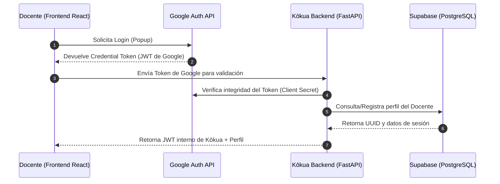
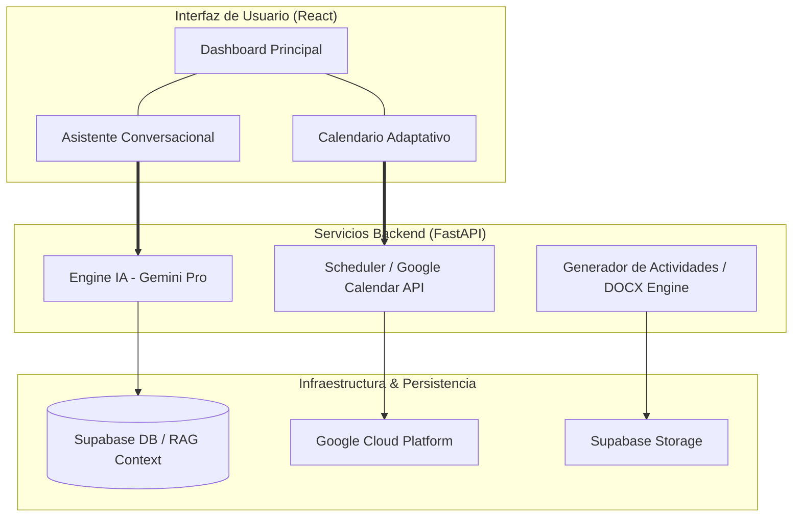
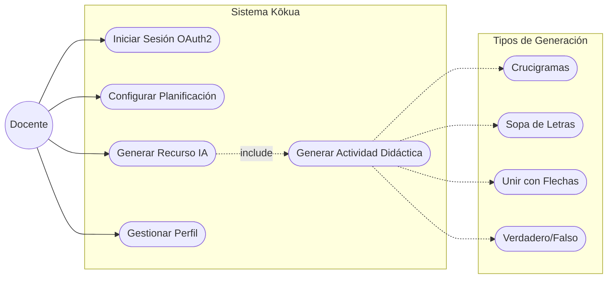
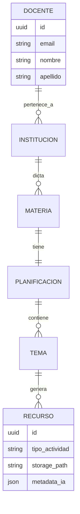
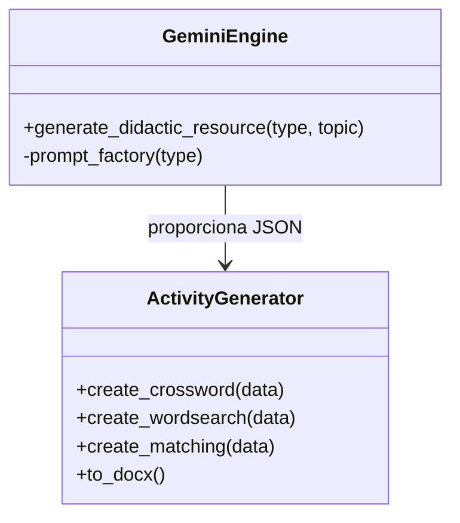

# Documentación Técnica: Proyecto Kōkua

# Este documento contiene los planos de ingeniería del sistema. Para visualizarlos en VS Code, presione Ctrl + Shift + V.

# 1. Flujo de Autenticación (OAuth2)

# 2. Mapa de Módulos y Arquitectura

# 3. Diagrama de Casos de Uso

# 4. Modelo Entidad-Relación (DER)

# 5. Diagrama de Clases (Lógica de Generación)
